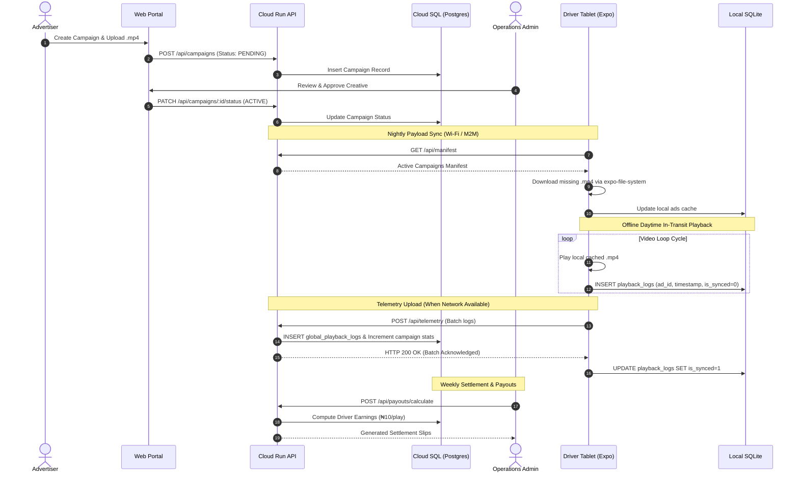

# Product Requirements Document (PRD): TripCast

---

## 1. Executive Overview

### Concept
**TripCast** transforms rideshare cars and taxis into mobile digital-out-of-home (DOOH) advertising hubs using smart 10-inch Android tablets.

### Core Value Proposition
- **Passengers:** Get continuous video entertainment during commutes.
- **Drivers:** Earn passive income through a transparent revenue-sharing model.
- **Advertisers:** Access a captive, measurable, professional audience in high-density commercial areas like Lagos.

### Financial & Revenue Structure
- **Ad Pricing Model:** Charges advertisers a tiered CPM (Cost Per Mille / 1,000 Impressions) rate of **₦5,000 per 1,000 views** (₦5.00 / play standard, up to ₦25.00 for premium targeting).
- **Profit Projections:**
  - **100 Tablets:** Realistically generates ~**₦830,000 net monthly profit** (after driver payouts, operational costs, and cloud hosting).
  - **1,000 Tablets:** Scales to ~**₦8.5M – ₦9.5M net monthly profit**.
- **Cost Offsets:** High gross CPM margins ensure initial capital expenditure on hardware is recovered rapidly as the fleet size scales.

### Data & Operational Strategy
- **Offline Caching:** Tablets pre-download ad schedules and video files over Wi-Fi overnight (at drivers' homes or central hubs). Videos play directly from local storage during the day, eliminating 4G streaming costs and daytime data consumption.
- **Enterprise Connectivity:** Uses dedicated M2M (Machine-to-Machine) SIM cards with unique numbers for remote device management, central updates, and impression tracking. Data expenses are managed directly as a business operational cost, not passed to drivers.

---

## 2. Technical Architecture & Tech Stack

### Client Mobile Application (Edge Hardware)
- **Framework:** React Native (Managed via Expo). Built directly into a standalone Android App Bundle/APK using EAS (`buildType: "apk"`) to bypass the Google Play Store for direct physical installation on tablets.
- **Target Compatibility:** Expo SDK 54.
- **Video Playback:** `expo-video` / `expo-av` for full-screen, uninterrupted offline video looping.
- **Local Database:** `expo-sqlite` for offline telemetry and impression logging.
- **File System:** `expo-file-system/legacy` for daily video payload downloads and cache management.

### Backend Cloud Infrastructure (Google Cloud Platform - GCP)
- **Storage:** Google Cloud Storage (GCS) for hosting `.mp4` video payloads.
- **API Service:** Google Cloud Run (Node.js / Express / TypeScript) to handle incoming telemetry data and serve daily manifests.
- **Core Database:** Cloud SQL (PostgreSQL) for user, campaign, fleet, and financial management.

---

## 3. System Roles & Interface Breakdown

### A. Client Web Portal (Advertisers)
- **Purpose:** Web interface for companies buying ad space and auditing campaign reach.
- **Key Features:**
  - **Campaign Setup & Checkout:** Upload `.mp4` ad creatives, select target date ranges and cities, set budgets (in ₦ NGN), and pay securely via payment gateways (e.g., Paystack/Flutterwave).
  - **Proof-of-Play Analytics:** Real-time dashboards showing total ad plays, unique active tablets, peak playback hours, and geographic distribution.
  - **Verification Logs:** Exportable audit reports mapping playback timestamps directly to specific vehicle IDs to prove ROI.

### B. Driver Tablet App (Vehicle Hardware)
- **Purpose:** Native Android application pre-installed on the dedicated 10-inch vehicle tablets.
- **Key Features:**
  - **Continuous Loop Engine:** Automatic, offline playback of cached video payloads synced daily from Google Cloud.
  - **Telemetry Logger:** Silently writes playback records (`ad_id`, `timestamp`) to a local SQLite database the exact moment a video completes its full cycle.
  - **Background Auto-Sync:** Uploads logged batches to the API whenever internet connectivity (M2M Cellular/Wi-Fi) is detected, without disrupting video playback.
  - **Driver Dashboard (Hidden/Menu):** Displays daily/weekly earnings based on validated ad plays completed during their shifts.

### C. Admin Central Console (Operations & Fleet)
- **Purpose:** Internal command center for the TripCast team to manage platform operations.
- **Key Features:**
  - **Ad Moderation:** Review and approve pending advertiser campaign assets before they are distributed to the tablet fleet.
  - **Fleet Health Monitoring:** Real-time monitoring of registered tablets, device heartbeats (last synced time), app versions, battery levels, and local storage capacity.
  - **Financial Hub:** Calculate driver performance payouts from validated telemetry logs and trigger automated bank transfers.

---

## 4. End-to-End Data Flow

---

## 5. Database Schema Blueprints

### A. Local Tablet Database (SQLite via `expo-sqlite`)

#### `ads` Table
| Column | Type | Description |
| :--- | :--- | :--- |
| `id` | `TEXT PRIMARY KEY` | Unique ID from backend manifest |
| `title` | `TEXT` | Ad campaign title |
| `local_file_path` | `TEXT` | Local device file path (`FileSystem.documentDirectory`) |
| `target_play_date` | `TEXT` | Effective scheduling date |

#### `playback_logs` Table
| Column | Type | Description |
| :--- | :--- | :--- |
| `id` | `INTEGER PRIMARY KEY AUTOINCREMENT` | Local row sequence |
| `ad_id` | `TEXT` | Foreign key referencing `ads(id)` |
| `timestamp` | `INTEGER` | Unix epoch millisecond of completed view |
| `is_synced` | `INTEGER DEFAULT 0` | Sync status flag (`0` = pending, `1` = synced) |

---

### B. Master Backend Database (PostgreSQL via GCP Cloud SQL)

#### `users` Table
| Column | Type | Description |
| :--- | :--- | :--- |
| `id` | `UUID PRIMARY KEY DEFAULT uuid_generate_v4()` | Unique user identifier |
| `email` | `VARCHAR(255) UNIQUE NOT NULL` | Login email address |
| `full_name` | `VARCHAR(255) NOT NULL` | User full name |
| `role` | `VARCHAR(20) NOT NULL` | Role: `'ADMIN'`, `'CLIENT'`, or `'DRIVER'` |
| `phone_number` | `VARCHAR(50)` | Contact number |
| `bank_account_number` | `VARCHAR(50)` | Driver settlement account number |
| `bank_code` | `VARCHAR(50)` | Bank routing code |

#### `campaigns` Table
| Column | Type | Description |
| :--- | :--- | :--- |
| `id` | `UUID PRIMARY KEY DEFAULT uuid_generate_v4()` | Unique campaign ID |
| `client_id` | `UUID REFERENCES users(id)` | Client owner ID |
| `title` | `VARCHAR(255) NOT NULL` | Campaign title |
| `video_url` | `TEXT NOT NULL` | Hosted GCP Cloud Storage URL |
| `total_budget` | `DECIMAL(12, 2) NOT NULL` | Budget in Nigerian Naira (`₦`) |
| `cost_per_play` | `DECIMAL(12, 2) DEFAULT 25.00` | Rate per verified view (₦) |
| `target_impressions`| `INTEGER DEFAULT 1000` | Target impression goal |
| `current_impressions`| `INTEGER DEFAULT 0` | Verified views count |
| `status` | `VARCHAR(20) DEFAULT 'PENDING'` | `'PENDING'`, `'APPROVED'`, `'REJECTED'`, `'ACTIVE'`, `'COMPLETED'` |
| `target_city` | `VARCHAR(100) DEFAULT 'Lagos'` | Geographic filter |
| `start_date` | `DATE NOT NULL` | Campaign launch date |
| `end_date` | `DATE NOT NULL` | Campaign expiry date |

#### `vehicles` Table
| Column | Type | Description |
| :--- | :--- | :--- |
| `id` | `UUID PRIMARY KEY DEFAULT uuid_generate_v4()` | Vehicle fleet ID |
| `driver_id` | `UUID REFERENCES users(id)` | Assigned driver |
| `tablet_device_id` | `VARCHAR(255) UNIQUE NOT NULL` | Hardware serial / device ID |
| `license_plate` | `VARCHAR(50) NOT NULL` | Vehicle license plate |
| `city` | `VARCHAR(100) DEFAULT 'Lagos'` | Operating city hub |
| `is_active` | `BOOLEAN DEFAULT TRUE` | Device operational status |
| `app_version` | `VARCHAR(20)` | Installed client app version |
| `battery_level` | `INTEGER` | Battery percentage (`0-100%`) |
| `storage_free_mb` | `INTEGER` | Available local disk space |
| `last_heartbeat` | `TIMESTAMP WITH TIME ZONE` | Last communication timestamp |

#### `global_playback_logs` Table
| Column | Type | Description |
| :--- | :--- | :--- |
| `id` | `BIGSERIAL PRIMARY KEY` | High-throughput sequence ID |
| `campaign_id` | `UUID REFERENCES campaigns(id)` | Associated campaign |
| `vehicle_id` | `UUID REFERENCES vehicles(id)` | Source vehicle tablet |
| `playback_timestamp`| `TIMESTAMP WITH TIME ZONE NOT NULL` | Timestamp of completion |
| `latitude` | `DECIMAL(9, 6)` | In-transit GPS latitude |
| `longitude` | `DECIMAL(9, 6)` | In-transit GPS longitude |

#### `driver_payouts` Table
| Column | Type | Description |
| :--- | :--- | :--- |
| `id` | `UUID PRIMARY KEY DEFAULT uuid_generate_v4()` | Payout reference ID |
| `driver_id` | `UUID REFERENCES users(id)` | Recipient driver |
| `vehicle_id` | `UUID REFERENCES vehicles(id)` | Vehicle source |
| `period_start` | `DATE NOT NULL` | Shift cycle start |
| `period_end` | `DATE NOT NULL` | Shift cycle end |
| `total_plays_verified` | `INTEGER NOT NULL DEFAULT 0` | Verified views count |
| `payout_amount` | `DECIMAL(12, 2) NOT NULL` | Payout total in Naira (`₦10/play`) |
| `status` | `VARCHAR(20) DEFAULT 'PENDING'` | `'PENDING'`, `'PROCESSING'`, `'PAID'`, `'FAILED'` |
| `payment_reference` | `VARCHAR(255)` | Bank / Gateway transaction ref |
| `paid_at` | `TIMESTAMP WITH TIME ZONE` | Settlement completion timestamp |
